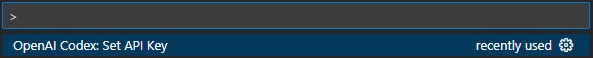
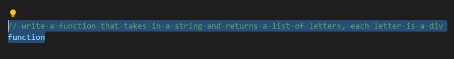
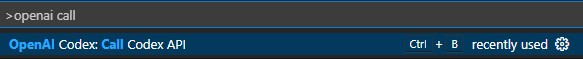
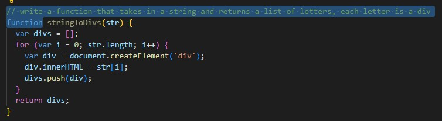
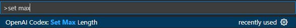
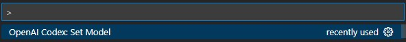
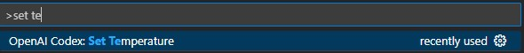
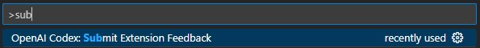

# OpenAI Codex README

OpenAI Codex Playground in your editor.

# Update Notes

API Key will now be saved.\
Added commands:
- OpenAI Codex: Set Temperature

# Features

There's no need to copy paste your code to the playground anymore; it now works directly in your editor.

Step 1:

Step 2 - highlight code as if you are going to paste it into the Playground, this will be the prompt:

Step 3:

Result:

You can change the max length: OpenAI Codex: Set Max Length

You an change the model: OpenAI Codex: Set Model

You can change the temperature: OpenAI Codex: Set Temperature

## Feedback

I would greatly appreciate your feedback as it will help us develop better features. Your input is invaluable and highly encouraged.
My email is vukrosic1@gmail.com